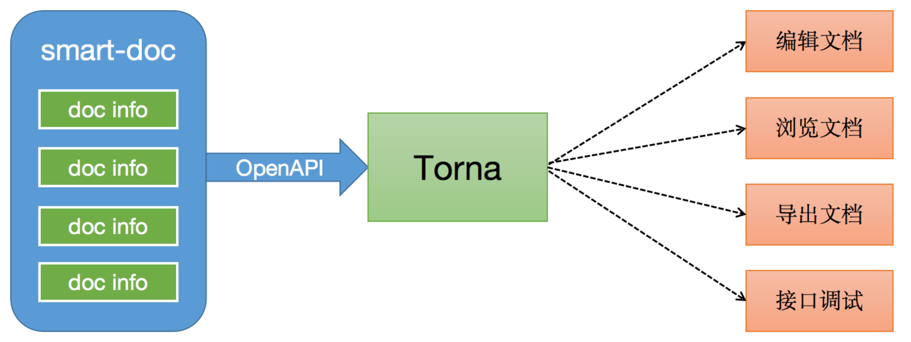

## smart-doc

> smart-doc is a tool that supports both JAVA REST API and Apache Dubbo RPC interface document generation.

## Introduce
Smart-doc is the first in the industry to put forward the concept of derivation based on JAVA generic definitions. It analyzes and generates interface documents based on the interface source code, and does not use any annotations to invade the business code. You only need to write comments in accordance with the java-doc standard, and smart-doc can help you generate a simple and clear documentation of Markdown, HTML5, Postman Collection2.0+, and OpenAPI 3.0+.

> Whether you are a very experienced boss or a newcomer. When encountering doubts about usage, we hope you can carefully read the wiki document of smart-doc official code cloud. We have organized each configuration item of smart-doc and its plug-ins and the problems that may be encountered in daily life into the document. Reading the documentation carefully is the greatest support for open source projects.

Check out the [quick start](zh-cn/start/quickstart.md) for details.

## Features
- Zero annotations, zero learning costs, and only need to write standard JAVA annotations.
- Automatic derivation based on source code interface definition, powerful return structure derivation.
- Support Spring MVC, Spring Boot, Spring Boot Web Flux (controller writing method), Feign.
- Support the derivation of asynchronous interface returns such as Callable, Future, CompletableFuture.
- Support JSR303 parameter verification specification on JavaBean, including group verification.
- The interface for JSON request parameters can automatically generate simulated JSON parameters.
- The definition of some commonly used fields can generate valid analog values.
- Support generating JSON return value examples.
- Support loading source code from outside the project to generate field comments (including jar packages released by standard specifications).
- Support to generate documents in multiple formats: Markdown, HTML5, Asciidoctor, Postman Collection, OpenAPI 3.0. Up- open document data, freely realize access to document management system.
- Support exporting error codes and various dictionary codes defined in the code to the interface document.
- Support Maven, Gradle plug-in easy integration.
- Support Apache Dubbo RPC interface document generation.
- The debug interface debugging html5 page fully supports file upload and download (@download tag tag download method) testing.

## 最佳实践
smart-doc + [Torna](http://torna.cn/) form an industry-leading document generation and management solution, using smart-doc to complete Java source code analysis and extract annotations to generate API documents without intrusion, and automatically push the documents to the Torna enterprise-level interface document management platform.

[smart-doc+Torna文档自动化](zh-cn/diy/integrated.md)

> Torna is an enterprise-level document management system jointly developed and exclusively promoted by smart-doc officials. Therefore, smart-doc officials will not connect to any other external document management systems, such as showdoc and yapi. Don't mention the PR for other file systems. Our core is to build the smart-doc+Torna solution.

## TODO
- Jakarta RS-API 2.x

## License

smart-doc is under the Apache 2.0 license. See the [LICENSE](https://github.com/smart-doc-group/smart-doc/blob/master/LICENSE) file for details.

**PS:** Smart-doc source code files are all with copyright notes. Please keep the original copyright when using the key code for the second open source, otherwise you will be responsible for the consequences!

## 谁在使用

> These are only part of the companies using smart-doc, for reference only. If you are using smart-doc, please [add your company here](https://github.com/smart-doc-group/smart-doc/issues/12) to tell us your scenario to make smart-doc better.

&nbsp;&nbsp;
&nbsp;&nbsp;
&nbsp;&nbsp;
&nbsp;&nbsp;
&nbsp;&nbsp;
&nbsp;&nbsp;
&nbsp;&nbsp;

&nbsp;&nbsp;

&nbsp;&nbsp;

## Acknowledgements
Thanks to [JetBrains SoftWare](https://www.jetbrains.com) for providing free Open Source license for this open source project. 

## Contact

Email： 836575280@qq.com

