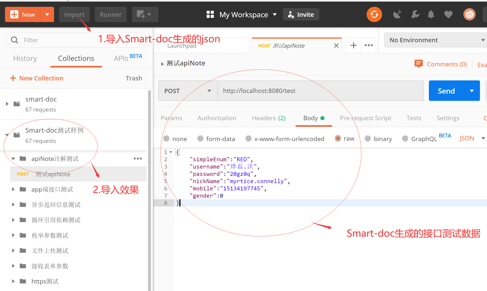
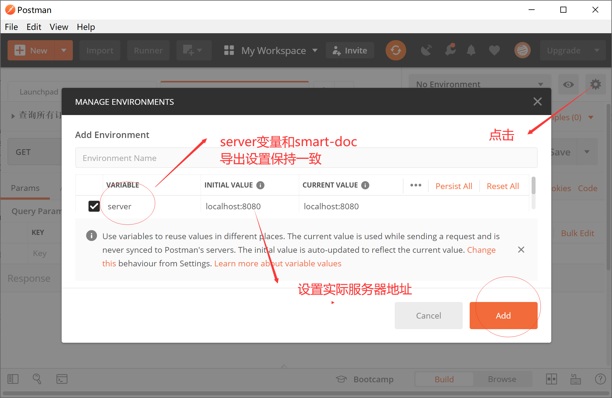

# 高级特性

## 公共请求头

**requestHeaders**

在smart-doc 2.2.2以前的版本中，在smart-doc.json中设置请求头是这样的

```json
{
    "requestHeaders": [ //设置请求头，没有需求可以不设置
        {
            "name": "token", //请求头名称
            "type": "string", //请求头类型
            "desc": "desc", //请求头描述信息
            "value": "kk", //不设置默认null
            "required": false, //是否必须
            "since": "-" //什么版本添加的改请求头
        }
    ]
}
```

很多用户在issue中说他们的token是通过拦截器拦截的，并没有显示的在接口层面去申明请求头。在2.2.2版本开始，我们增加了两个配置属性：

- `pathPatterns` 配置请求头的作用路径，和拦截器配置`pathPatterns`一致的，多个正则式之间用逗号隔开。
- `excludePathPatterns` 配置在那些path上忽略该请求头。和拦截器的`excludePathPatterns`一致的，多个正则式之间用逗号隔开。

所以你可以根据自己的需求来增加上面两个配置属性。例如：

```json
{
    "requestHeaders": [ //设置请求头，没有需求可以不设置
        {
            "name": "token", //请求头名称
            "type": "string", //请求头类型
            "desc": "desc", //请求头描述信息
            "value": "kk", //不设置默认null
            "required": false, //是否必须
            "since": "-", //什么版本添加的改请求头
            "pathPatterns": "/app/test/**", //只有以/app/test/开头的url才会有此请求头
            "excludePathPatterns": "/app/login" // 登录url=/app/page/将不会有该请求头
        }
    ]
}
```
> smart-doc完全借鉴了Spring的PathMatcher的匹配，因此相关的路径正则规则也是和因此PathMatcher一致的，
使用时请自行研究下PathMatcher并书写正确正则表达式，否则可能配置了后效果和你想的不一样。


## 公共请求参数
* @since `2.2.3`

**requestParams**

```json
{
    "requestParams": [
        {
            "name": "configPathParam", //请求参数名称
            "type": "string", //请求参数类型
            "desc": "desc", //请求参数描述信息
            "paramIn": "path", // path 或者query
            "value": "testPath", //不设置默认null
            "required": false, //是否必须
            "since": "-", //什么版本添加的改请求参数
            "pathPatterns": "**", //正则表达式过滤请求, 所有参数都会有此参数
            "excludePathPatterns": "/app/page/**" //参考请求头中的用法
        }
    ]
}
```

#### `paramIn`
* `path`: path参数, id为公共请求参数

```java
/**
 * 接收数组类型pathVariable
 * @return
 */
@GetMapping("/test/{id}")
public CommonResult<String[]> testPathVariable(@PathVariable("id") String[] id ) {
    return CommonResult.ok().setResult(id);
}
```

* `query`: query参数, configQueryParam为公共请求参数

```java
/**
 * post请求测试query参数
 *
 * @tag 顶顶顶到达
 * @author cqmike
 * @return
 */
@PostMapping("configQueryParamPost")
public CommonResult<Void> configQueryParamPost(String configQueryParam) {

    return CommonResult.ok();
}
```

## 静态常量替换

在java web接口开发的过程中，有用户会在controller的path中使用静态场景。因此也是希望smart-doc能够解析静态常量获取到真实的值。
下面来看下例子：

```java
/**
 * Test Constants
 *
 * @param page 页码
 */
@GetMapping(value = "testConstants/" + ApiVersion.VERSION)
public void testConstantsRequestParams(@RequestParam(required = false,
        defaultValue = RequestValueConstant.PAGE_DEFAULT_NONE,
        value = RequestParamConstant.PAGE) int page) {

}
```
针对这种常量的使用，smart-doc要求用户配置产量类，smart-doc根据设置的常量类分析形成常量容器，在做接口分析是从常量容器中查找做替换。
配置参考输入：

```json
{
   "allInOne":true,
   "apiConstants":[{
        "constantsClassName":"com.power.doc.constants.RequestParamConstant"
   },{
        "constantsClassName":"com.power.doc.constants.RequestValueConstant"
   },{
       "constantsClassName":"com.power.doc.constants.ApiVersion"
   }]
}
```
如果是单元测试，配置参考如下

```java
ApiConfig config = new ApiConfig();
config.setApiConstants(
       ApiConstant.builder().setConstantsClass(RequestParamConstant.class),
       ApiConstant.builder().setConstantsClass(RequestValueConstant.class),
       ApiConstant.builder().setConstantsClass(ApiVersion.class)
);
```
> 由于存在不同常量类中常量同名的情况，因此smart-doc在加载配置的常量类创建常量池的时候，每个常量是带上类名前缀的。
例如ApiVersion类中的VERSION常量。最后的名字是`ApiVersion.VERSION`。这就要求在使用常量的时候使用`类名.常量名`的方式。
当然常量是是写在接口中还是普通的常量类中都是支持加载解析的。


## 响应字段忽略

有同学在使用smart-doc时提问：“如何忽略响应实体中的某个字段？”，例如像密码`password`这种字段敏感字段，smart-doc在一开始开发的时候就考虑到了这种情况，因此我们对java的一些json序列化库做了支持，像Spring框架默认使用的`jackson`和国内用户使用较多的`Fastjson`都是支持的。
- 为什么不用@ignore来标注返回字段忽略？这是一种掩耳盗铃的做法，仅仅是表面文档不展示，数据依旧返回了，因此这是smart-doc不支持的原因。还是使用框架的注解来控制吧。

### 使用jackson注解忽略

一般spring框架默认使用的是`jackson`作为json序列化和反序列化库。

```java
public class JacksonAnnotation {

    /**
     * 用户名
     */

    @JsonProperty("name")
    private String username;


    /**
     * 身份证号
     */
    @JsonIgnore
    private String idCard;
}
```
像这个idCard使用@JsonIgnore注解后，接口不会看到该字段，smart-doc发现该注解也不会把该字段显示在接口文档中。
### Fastjson忽略响应字段
Fastjson也自己用于忽略字段的注解，Fastjson使用 `@JSONField(serialize = false)`,起关键作用的是`serialize = false`

```java
public class FastJson {

    /**
     * 用户名
     */
    @JSONField(name = "name")
    private String username;


    /**
     * 身份证号
     */
    @JSONField(serialize = false)
    private String idCard;
}
```
如果你在项目中使用了Fastjson替代默认的Jackson，按照上面的`idCard`字段这样写上注解后，无论是真实的数据响应还是smart-doc的文档都能帮你
忽略掉相关字段。

### 忽略高级设置
smart-doc官方还支持Fastjson和Jackson的高级忽略配置，例子如下：
```java
/**
* 测试mybatis-plugs page字段忽略
* @author yu 2021/7/11.
*/
@JSONType(ignores ={"current", "size", "orders", "hitCount", "searchCount", "pages","optimizeCountSql"})
@JsonIgnoreProperties({"current", "size", "orders", "hitCount", "searchCount", "pages","optimizeCountSql"})
public class MybatisPlusPage<T> extends Page<T> {


}
```
## 导出数据字典
在swagger中针对国内的场景，是很难做到字典导出的。但是smart-doc中可以很容易的把枚举字典导出到文档中。
例如代码中有一个订单状态枚举字典。
```java

public enum OrderEnum {

    WAIT_PAY("0", "已支付"),

    PAID("1", "已支付"),

    EXPIRED("2","已经失效");

    private String code;

    private String desc;

    OrderEnum(String code, String desc) {
        this.code = code;
        this.desc = desc;
    }

    public String getCode() {
        return this.code;
    }


    public String getDesc() {
        return this.desc;
    }
}
```
配置一下就可以导出
```json
{
    "dataDictionaries": [
        {
            "title": "订单状态码字典", //数据字典的名称
            "enumClassName": "com.xx.OrderEnum", //数据字典枚举类名称
            "codeField": "code", //数据字典字典码对应的字段名称
            "descField": "message" //数据字典对象的描述信息字典
        }
    ]
}
```
> 由于smart-doc为了减少用户去配置字典项，因此使用的反射原理去遍历的枚举项，反射是不能获取到注释的，
这里就要求字典的描述直接定义在编码中。当然错误字典也是同理来处理。

## 源码加载

### 为什么外部jar没有注释
在编译java代码打包成jar包后，编译器会将代码中的注释去除，并且泛型也被擦除(例如定义泛型T,编译后T将变成Object),smart-doc是依赖泛型和源码推荐出文档的，因此如果接口使用的类来自外部jar包或者是其他模块，那么需要做一些处理才能让smart-doc能够正确分析出文档。
### 如何让smart-doc加载源码
Smart-doc作为一款完全依赖源码注释来分析生成文档的工具。如果没有源代码，那么在生成文档时将只能看到字段名和字段类型等信息，注释相关的信息都将无法生成，对于一个所有代码都在一个单独项目中的情况，你不需要考虑任何东西，Smart-doc能完美的完成你想要的文档，但是对一个多模块项目，或者项目依赖了一个独立的jar包的情况，smart-doc将无法加载到它所运行模块之外的代码。下面将会介绍如何来让Smart-doc加载到运行模块外的项目代码。

 **注意：自smart-doc-maven-plugin 1.0.2版本开始，使用maven的插件能够实现自动源码加载。** 
#### 通过`ApiConfig`类设置(不推荐)
代码示例如下：

```java
ApiConfig config = new ApiConfig();
//以前的版本为setSourcePaths，SourceCodePath为SourcePath
config.setSourceCodePaths(
        SourceCodePath.path().setDesc("本项目代码").setPath("src/main/java"),
        //smart-doc对路径自动会做处理，无论是window合适linux系统路径，直接拷贝贴入即可
        SourceCodePath.path().setDesc("加载外部项目源码").setPath("E:\\Test\\Mybatis-PageHelper-master\\src\\main\\java")
);
```
这样smart-doc就能将外部的源码载入。

#### 通过`maven`的`classifier`来指定源码包(不推荐)
这里先看如何使用classifier来加载源码包。

```xml
<!--依赖的库-->
<dependency>
    <groupId>com.github.shalousun</groupId>
    <artifactId>common-util</artifactId>
    <version>1.8.6</version>
</dependency>
<!--依赖库源码，使用smart-doc的插件无需使用这种方式加载sources-->
<dependency>
    <groupId>com.github.shalousun</groupId>
    <artifactId>common-util</artifactId>
    <version>1.8.6</version>
    <classifier>sources</classifier>
    <!--设置为test,项目发布时source不会放入最终的产品包-->
    <scope>test</scope>
</dependency>
```
这样不需要像上面一样设置源码加载路径了。但是并不是所有的打包都能有源码包。需要在打包是做规范化处理。

 **注意：** 在加载jar包和source源码jar包时，如出现代码导入错误可尝试变更二者依赖顺序，推荐使用smart-doc最新的maven插件或者gradle插件。

#### 公有jar包打规范(推荐)
当你发布公共jar包或者dubbo应用api接口共有jar包时，在maven的plugs中加入`maven-source-plugin`,示例如下：

```xml
<!-- Source -->
<plugin>
    <groupId>org.apache.maven.plugins</groupId>
    <artifactId>maven-source-plugin</artifactId>
    <version>3.2.1</version>
    <executions>
        <execution>
            <phase>package</phase>
            <goals>
                <goal>jar-no-fork</goal>
            </goals>
        </execution>
    </executions>
</plugin>
```
这样发布的时候就会生成一个`[your jar name]-sources.jar`的源码包，这个包也会一起发布到私有仓库。这样就可以通过`classifier`来指定`sources`了。如果还是不清楚可以直接参考`smart-doc`源码的`pom.xml`配置。

**注意：** 经测试验证，如果只是通过`install`到本地，即便是指定了`sources`也无法读取到源码，只有将公用的模块`deploy`到`nexus`这样的私服上才能正常使用。


### 第三方源码示例

当前在做项目开发时难免会使用到一些第三方的开源工具或者是框架，例如：mybatis-plus，smart-doc本身是基于源代码来分析的，如果没有源代码smart-doc将不能正确的生成完整的接口文档。 **当然如果使用smart-doc-maven-plugin 1.0.2版本开始的插件，插件可以自动加载到相关使用依赖的源码，使用插件后就不需要自行去配置source的依赖了，推荐使用插件** 

#### mybatis-plus分页处理
在使用mybatis-plus的分页时，如果使用`IPage`作为Controller层的返回，smart-doc无论如何也不能扫描出正确的文档，因为`IPage`是一个纯接口，所以可以在service层正常使用`IPage`作为分页返回，然后在Controller层做下转换。

```java
/**
 * 分页查询订单信息
 * @param pageIndex 当前页码
 * @param pageSize 页面大小
 * @return
 */
@GetMapping(value = "page/{pageIndex}/{pageSize}")
public Page<Order> queryPage(@PathVariable int pageIndex , @PathVariable int pageSize) {
    Page<Order> page = new Page<>(pageIndex,pageSize);
    page.setRecords(orderService.selectPage(pageIndex,pageSize).getRecords());
    return page;
}
```
当然也要在项目中引入mybatis-plus的源码

```xml
 <dependency>
     <groupId>com.baomidou</groupId>
     <artifactId>mybatis-plus-extension</artifactId>
     <version>3.2.0</version>
     <classifier>sources</classifier>
     <scope>test</scope>
</dependency>
```
>classifier这种方式都不推荐使用，请使用maven插件或者gradle插件，插件可以实现自动加载。

## Postman文档


从Smart-doc 1.7.8版本开始，smart-doc支持生成Postman的json文件，你可以使用Smart-doc生成整个项目的或者某个微服务所有接口的Postman json文件，然后通过将这个json文件导入Postman的Collections做测试。导出json.

```java
ApiConfig config = new ApiConfig();
//导出postman建议将server设置成这样，然后在postman中建立一个server环境变量，调试时只需根据实际服务器来修改server的值。
config.setServerUrl("http://{{server}}");
//已省略config，详细配置请参考其它文档
PostmanJsonBuilder.buildPostmanApi(config);
//自smart-doc 1.8.1开始使用下面的方法
PostmanJsonBuilder.buildPostmanCollection(config);
```

导入json到Postman效果如下图：


### postman中设置环境变量


 **注意：** 在Add Environment中不要忘记给环境设置名称(例如：本地开发测试)，否则按上图不能保存成功。


