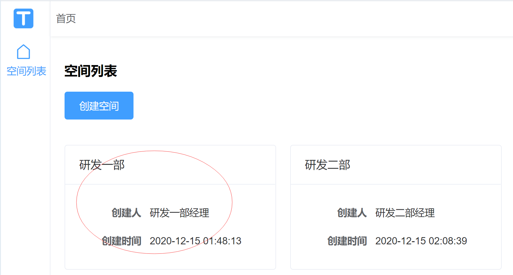
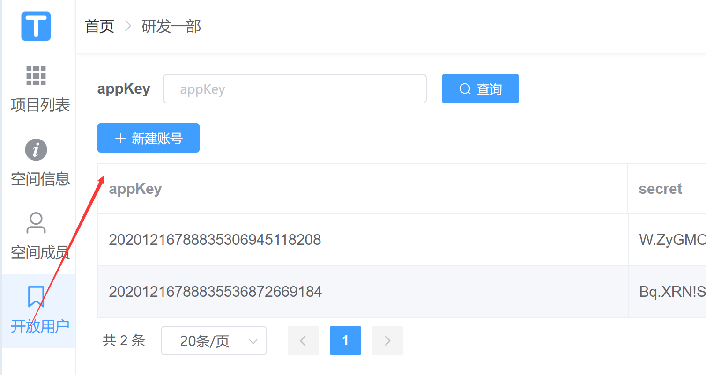
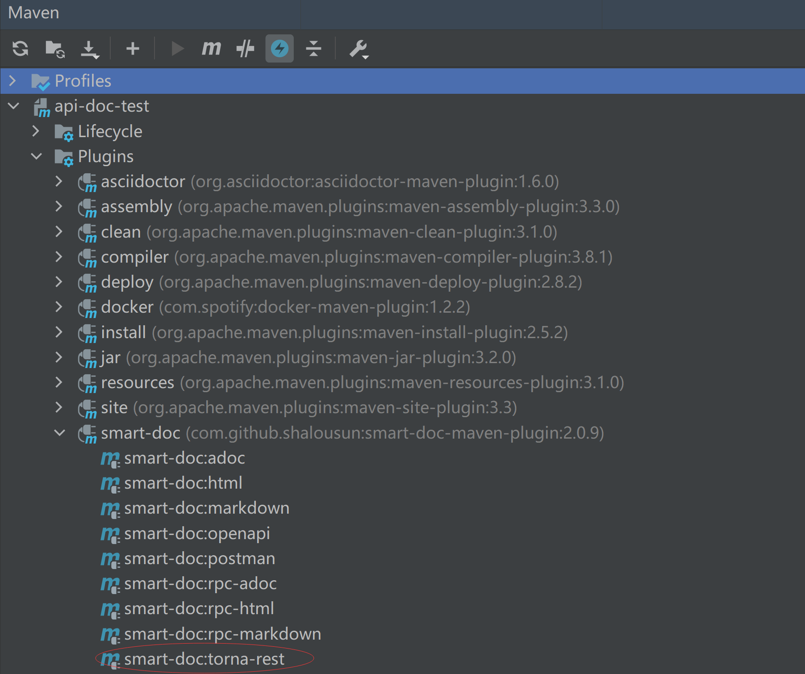

# 接口UI集成

## `swagger UI`集成

smart-doc支持生成openapi 3.0+规范的接口文档，因此你可以使用支持openapi 3.0+规范的文档管理系统或者ui界面来展示smart-doc生成的文档。
本文来说下如何快速集成swagger ui来在开发中测试你的接口。

### 添加依赖

```
<!--swagger ui -->
<dependency>
    <groupId>org.springdoc</groupId>
    <artifactId>springdoc-openapi-ui</artifactId>
    <version>1.5.0</version>
</dependency>
```
smart-doc支持的openapi规范版本比较高，因此需要集成1.5.0或者是更高的版本。
### 配置swagger ui
在application配置文件中添加如下配置
```
# custom path for swagger-ui
springdoc:
  swagger-ui:
    path: /swagger-ui-custom.html
    operations-sorter: method
   #custom path for api docs
    url: /doc/openapi.json
```
- url是配置的关键，代表指向smart-doc生成的openapi.json文件。并且你需要将openapi生成到`src/main/resources/static/doc`下。

生成好api文件后启动你的应用访问`http://localhost:8080/swagger-ui-custom.html`即可看到文档。
接下来你就可以在开发的时候使用这个ui界面来自测了。

 **提醒：** 关于swagger ui的其他配置就自行研究吧，我们也不会。


## `smart-doc`调试页面

从smart-doc 2.0.0版本开始，在html的allInOne的模式下。可以添加`"createDebugPage": true`的配置。smart-doc会创建一个debug.html的页面。
在让生成smart-doc生成文档时直接放入到`static/doc/`下，这样可以直接启动程序访问页面`localhost:8080/doc/debug.html`进行开发调试。
从smart-doc 2.0.1开始，对html文档，无论是allInOne还是非allInOne模式都能够生成debug页面。smart-doc目前的debug页面支持文件上传和文件下载测试。

### 配置

```json
{
  "serverUrl": "http://localhost:8080",
  "isStrict": false,
  "allInOne": true,
  "outPath": "src/main/resources/static/doc",
  "coverOld": true,
  "style":"xt256",//喜欢json高亮的可以设置
  "createDebugPage": true, //启用生成debug
  "md5EncryptedHtmlName": false,
  "projectName": "SpringBoot2-Open-Api"
}
```
### 跨域配置
有的开发人员直接在idea中使用【Open In Browser】打开smart-doc生成的debug页面，如果非要这做，前端js请求后台接口时就出现了跨域。因此你需要在后端配置跨域。
这里以SpringBoot为例：

```java
@Configuration
@EnableWebMvc
public class WebConfig implements WebMvcConfigurer {

    /**
     * 跨域配置会覆盖默认的配置，
     * 因此需要实现addResourceHandlers方法，增加默认配置静态路径
     * @param registry
     */
    @Override
    public void addResourceHandlers(ResourceHandlerRegistry registry) {
        registry.addResourceHandler("/**")
                .addResourceLocations("classpath:/resources/")
                .addResourceLocations("classpath:/static/");
    }
    
    @Override
    public void addCorsMappings(CorsRegistry registry) {
        registry.addMapping("/**")
                .allowedOrigins("*")
                .allowedMethods("*")
                .allowCredentials(true);
    }
}
```
>如果采用服务器方式来访问页面，则无需配置。

### 界面效果


### debug页面调试
在使用smart-doc生成的html调试页面做接口调试时，你可能会碰到一下问题，通常当点击`Send Request`按钮后，按钮变成了红色就说明接口出错或者是debug页面出现错误。这时请打开浏览器的调试控制台查看问题或者是调试。smart-doc创建的页面中只是用了jquery和原生js来开发的，`debug.js`是用于处理接口测试请求的，`search.js`是用于处理文档目录标题搜索的。源码都未做压缩，可以直接调试页面的js源码。调试操作参考如下图：


## torna集成


### 简介
smart-doc经过3年的开源持续发展中，我们收到了很多的用户的需求，很多企业用户非常需要一个好用的集中化API管理平台。在过去Yapi可以说是国内开源市场长用户量比较多的开源产品。但是在笔者的观察中，Yapi有诸多的问题。因此2020年，我一直在社区寻找合适的开源合作者来重心打造一款企业级的API文档管理平台。很幸运的在开源社区找到了@tanghc。@tanghc是一个有多个开源项目的作者，而且非常热衷于开源。我向@tanghc描述了我个人做API管理平台的项目和理念。最终我们达成了做torna的共识。为开源社区提供一个好的文档生成和管理的解决方案。当然未来我们会探索出商业化的产品。但是smart-doc和smart-doc的maven、gradle插件是免费。当前提供的torna基础功能也是免费开源给社区使用。torna商业版本主要面向企业的高级功能版本。

### 文档全流程自动化
smart-doc + [Torna](http://torna.cn) 组成行业领先的文档生成和管理解决方案，使用smart-doc无侵入完成Java源代码分析和提取注释生成API文档，自动将文档推送到Torna企业级接口文档管理平台。


>需要从smart-doc 2.0.9才支持推送文档到torna，当然推荐使用smart-doc同学关注新版本的发布。推荐smart-doc使用2.1.7及以上版本，torna 1.6.2及以上版本
### 如何把文档自定推送到torna
首先是在java的spring项目中集成smart-doc。smart-doc的集成看smart-doc官方的其他文档。其实smart-doc一直的理念都是让使用变的简单。因此要把文档推送到smart-doc也很简单，只需要在smart-doc.json文件中添加几行推送到torna的配置

```
{
  "serverUrl": "http://127.0.0.1", //服务器地址,非必须。导出postman建议设置成http://{{server}}方便直接在postman直接设置环境变量
  "isStrict": false, //是否开启严格模式
  "packageFilters": "",//controller包过滤，多个包用英文逗号隔开
  "projectName": "smart-doc",//配置自己的项目名称
  "appKey": "20201216788835306945118208",// torna平台对接appKey,, @since 2.0.9
  "appToken": "c16931fa6590483fb7a4e85340fcbfef", //torna平台appToken,@since 2.0.9
  "secret": "W.ZyGMOB9Q0UqujVxnfi@.I#V&tUUYZR",//torna平台secret，@since 2.0.9
  "openUrl": "http://localhost:7700/api",//torna平台地址，填写自己的私有化部署地址@since 2.0.9
  "debugEnvName":"测试环境", //torna测试环境
  "debugEnvUrl":"http://127.0.0.1",//torna
}
```
 **注意：**  `appKey`,`appToken`,`secret`如果你不是管理员需要去问管理员了解你推送的项目具体的相关信息。

如果你是管理员可以在torna的空间管理中查看。

查看空间

查看空间的appKey，secret等信息

查看空间里相关项目的token


### 推送操作
集成smart-doc并完成推送配置后，就可以使用利用smart-doc的maven或者是gradle插件来直接把文档推送到torna中了。

> 如果你想使用命令行或者是gradle，请查看smart-doc官方maven和gradle插件使用的文档，此处不再赘述。


