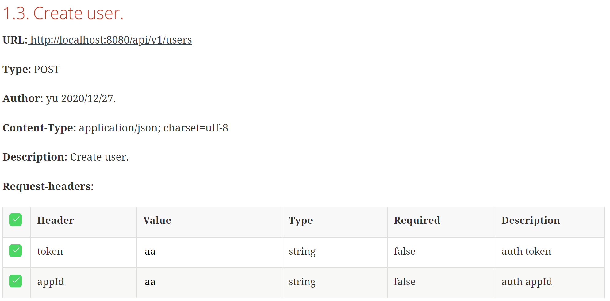
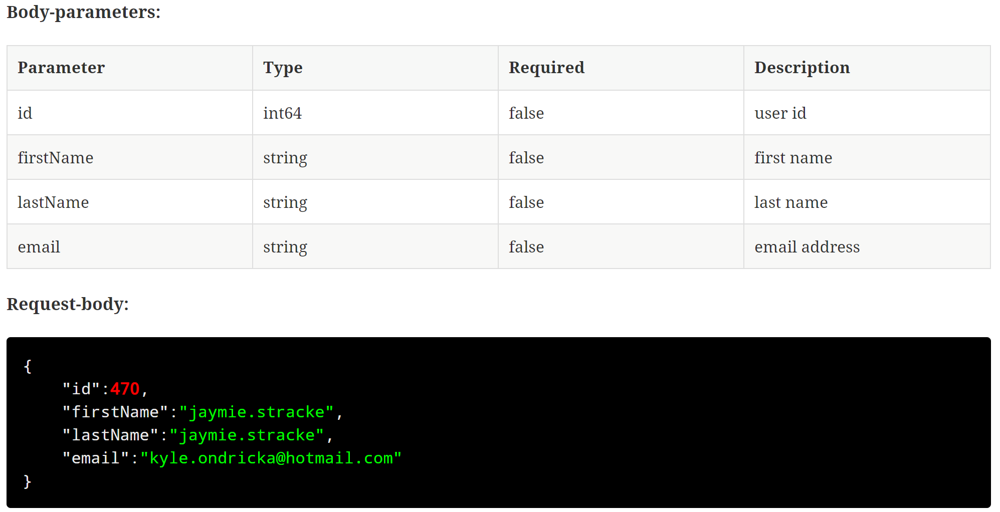
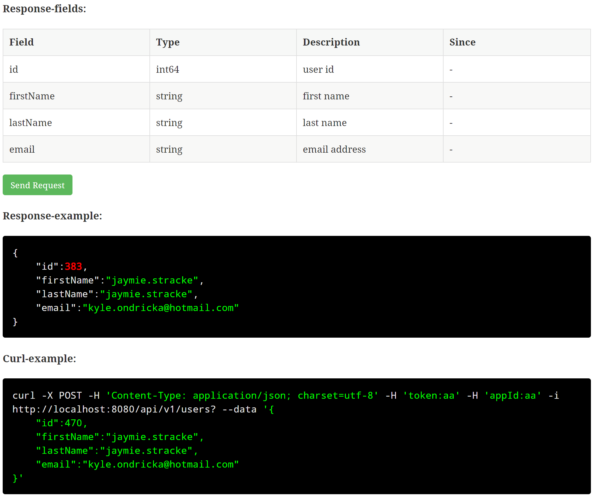
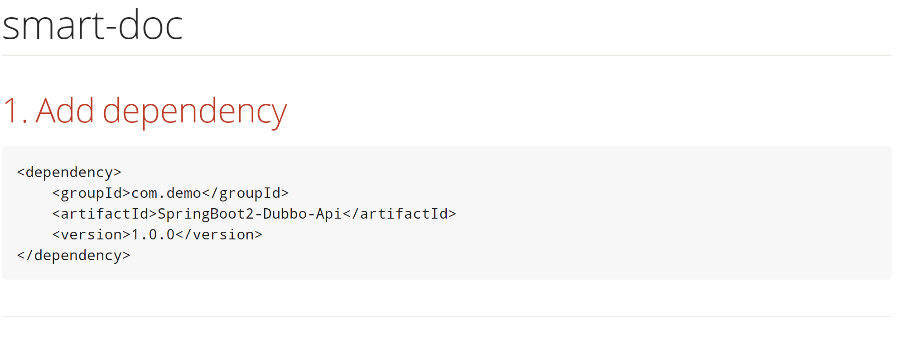
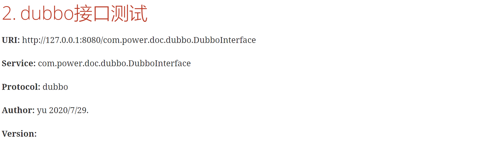
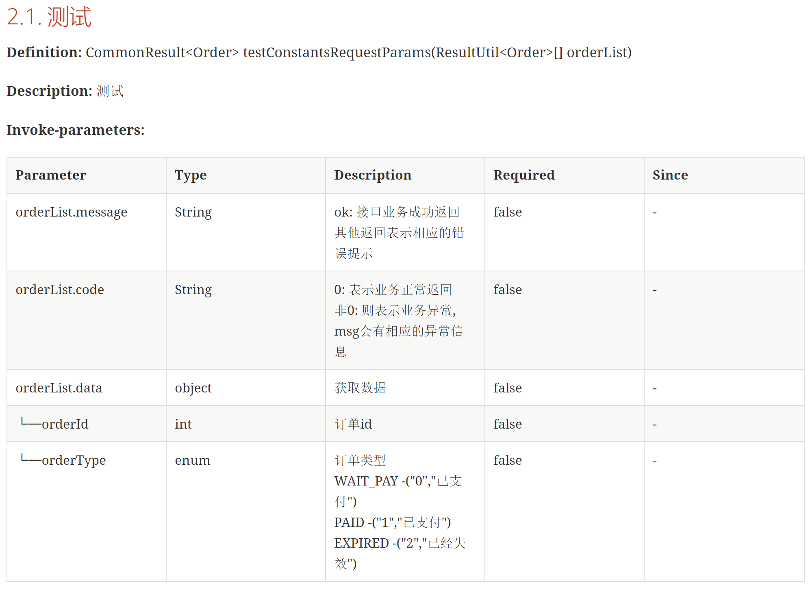
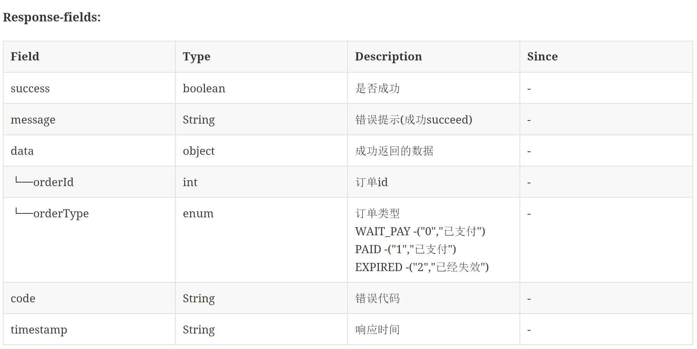

# 文档效果图

## Smart-doc生成文档效图

### Smart-doc接口文档效果图

### html全局效果

## dubbo文档效果图

### dubbo接口文档效果图

### html格式dubbo全局文档

## 用户案例
下面是一些网友在开源项目中使用的smart-doc生成api文档的案例
- [豆瓣电影Plus](https://api.doubans.com/)