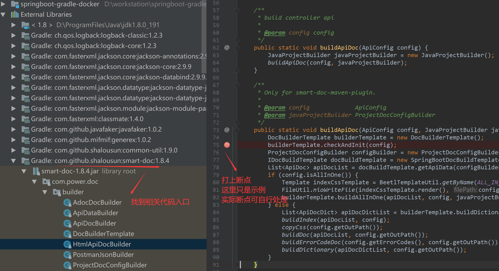
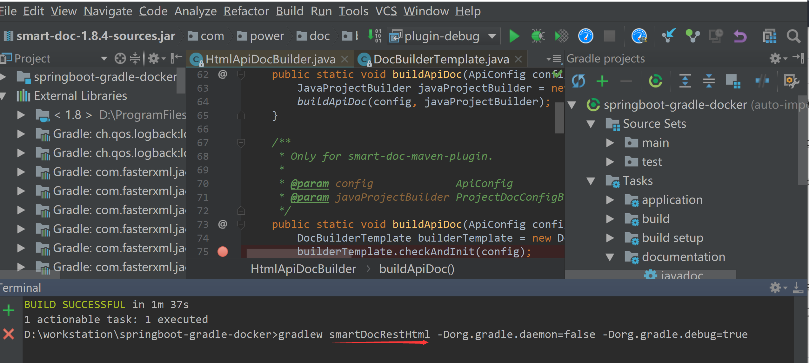
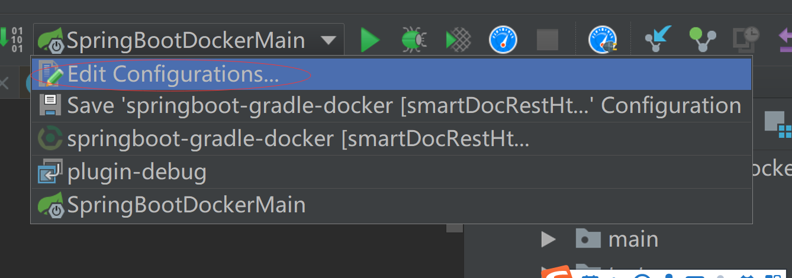
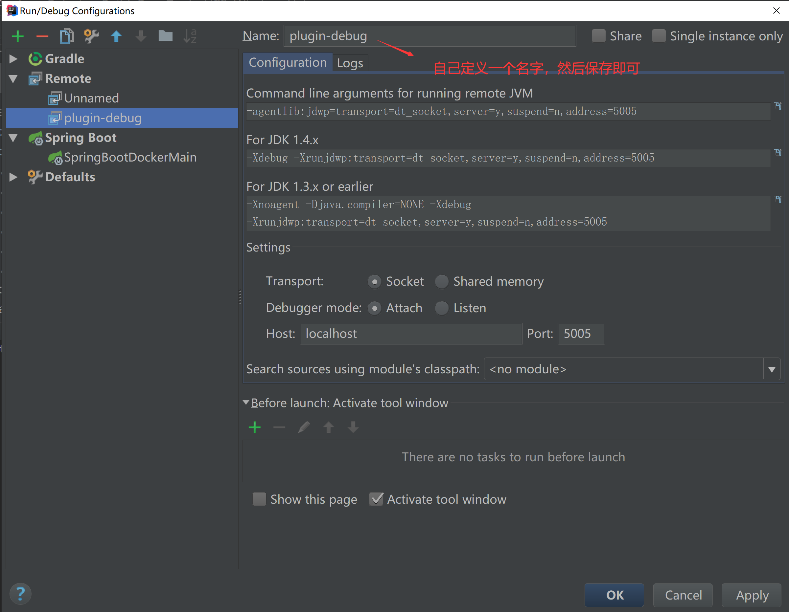
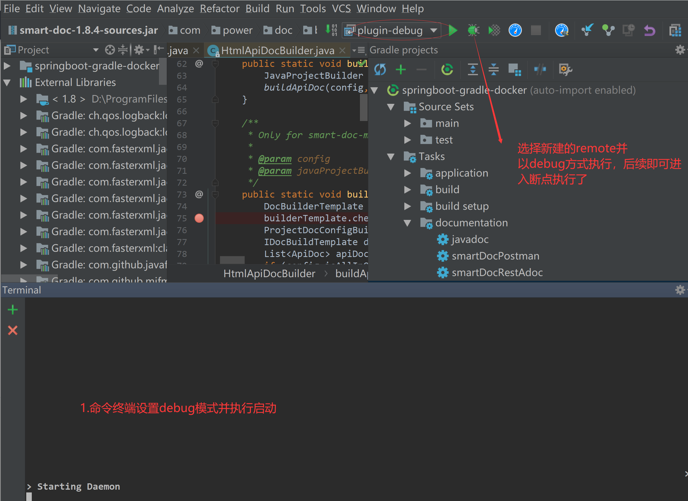

`smart-doc`官方的`Gradle`插件开发正在进行中，当前完成了插件的主体结构，在优化测试中，请耐心等待发布。

# 插件调试
`smart-doc-gradle-plugin`插件依赖于`smart-doc`来完成文件的解析，`smart-doc-gradle-plugin`主要是为了用户更加快速简易的
将`smart-doc`集成到项目
中生成`API`文档，同时`smart-doc-gradle-plugin`插件也是给`smart-doc`进行赋能，实现自动分析一些`source jar`的源码的路径，
然后将路径赋予`smart-doc`方便更好的基于源码分析。

但是`smart-doc`面对着很多的用户，各式各样的代码我们在开发的时候并不能完全考虑到。有的代码甚至作者也从未写过。
因此出现一些不明原因时通常需要用户自己进行调试。本节将介绍如何在自己的项目中通过`smart-doc-gradle-plugin`来调试`smart-doc`底层的解析。
## 添加smart-doc依赖
添加`smart-doc`依赖主要是方便直接查看到源码调试。未发生错误，不需要调试事并不需要在自己的项目中添加`smart-doc`依赖。
```
dependencies {
    testCompile 'com.ly.smart-doc:smart-doc:【最新版本】'
}
```
找到`smart-doc`源码打上断点。操作如下图：

## 命令行终端设置debug模式
`Gradle`插件的调试并不像调试`JAVA`程序和`Maven`插件那么简单。在`IDEA`上直接点击`debug`启动相关操作就可以直接调试了。
需要实现在命令行设置调试模式。操作如下图：

图中主要是打开命令行终端指定让`smart-doc-gradle-plugin`的某一个`task`使用`debug`模式运行, 
如上图所示指定构建`html`文档的`task`来开启`debug`模式，命令示例如下：

```
gradlew smartDocRestHtml -Dorg.gradle.daemon=false -Dorg.gradle.debug=true
```
如果执行上面命令出现下面的错误

```
错误: 找不到或无法加载主类 org.gradle.wrapper.GradleWrapperMain
```
则请先执行下面一条命令让`Gradle`自动下载设置好`GradleWrapper`,当然网络问题自行处理。
```
gradle wrapper
```
## 添加一个远程调试监听
点击 **Edit Configurations**

点开左边的“+”号，点击“Remote”

## 执行调试
完成上面的操作后即可用`debug`调试进入插件和`smart-doc`了，然后查看`smart-doc`的执行情况。操作如下图

