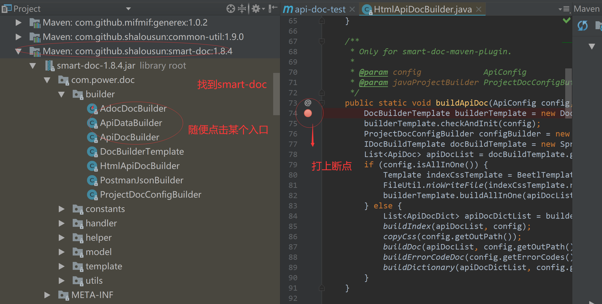
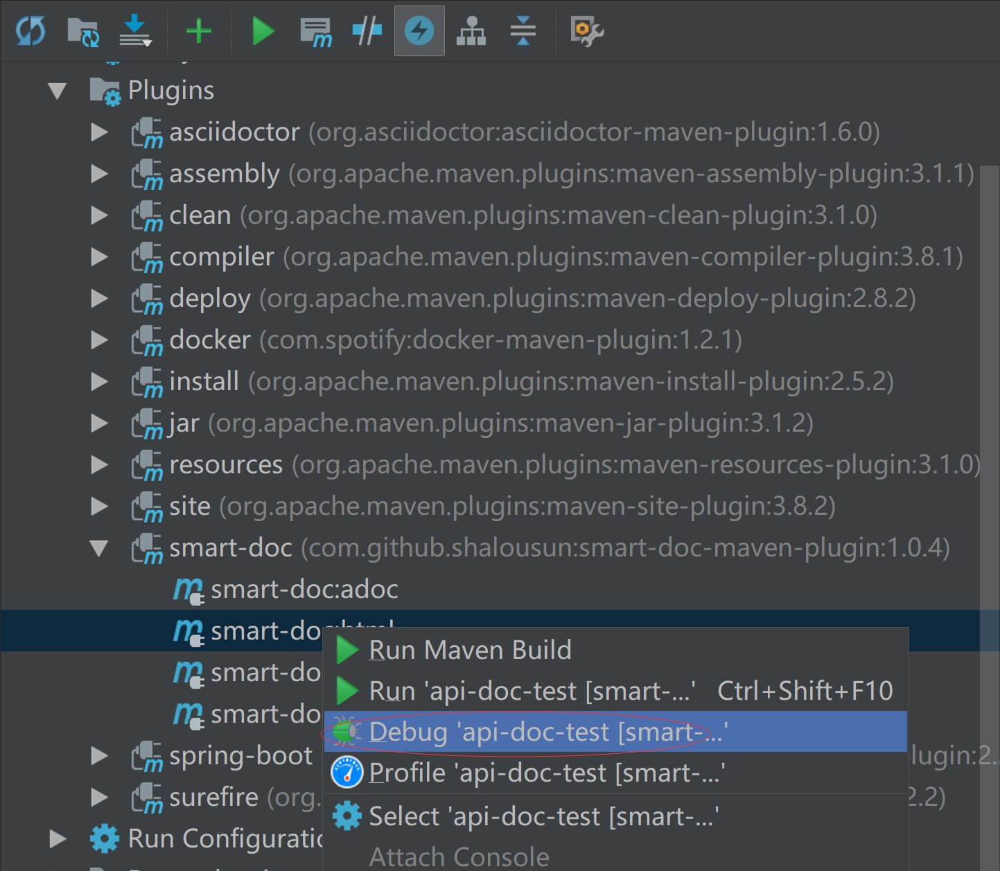

在使用`smart-doc-maven-plugin`插件来构建生成`API`文档的过程中可能会出现一些错误问题。
如果一些复杂问题出现时仅仅是粗略的将错误信息放在提到`issue`中，
官方并不能根据这些简单的错误信息来解决问题，因为用户的使用环境和所写的代码都是我们无法模拟的。
因此我们希望使用`smart-doc-maven-plugin`的用户在报错时能够通过`debug`来获取到更详细的信息。
在提`issue`时添加详细的问题描述，这样也能帮助我们更加快速的修改问题。
下面将介绍如何来调试`smart-doc-maven-plugin`插件。

# 添加smart-doc依赖
因为`smart-doc-maven-plugin`最终是使用`smart-doc`来完成项目的源码分析和文档生成的，
通常情况下真正的调试的代码是`smart-doc`。但这个过程主要通过`smart-doc-maven-plugin`来排查。

```
<dependency>
     <groupId>com.ly.smart-doc</groupId>
     <artifactId>smart-doc</artifactId>
     <version>[最新版本]</version>
     <scope>test</scope>
</dependency>
```
**注意：** 使用`smart-doc`的版本最好和插件依赖的`smart-doc`版本一致。

# 添加断点
添加断点如图所示


# Debug模式运行构建目标
`maven`插件在`idea`中运行`debug`非常简单，操作如下图。

这样就可以直接进入断点了。

**提示：** 上面是通过插件去作为入口调试`smart-doc`的源码，如果你想调试插件本身的源码执行过程，则将插件的依赖添加到项目依赖中,如下：

```
<dependency>
    <groupId>com.ly.smart-doc</groupId>
    <artifactId>smart-doc-maven-plugin</artifactId>
    <version>【maven仓库最新版本】</version>
</dependency>
```
然后通过上面
的类似步骤调试`smart-doc-maven-plugin`的源码