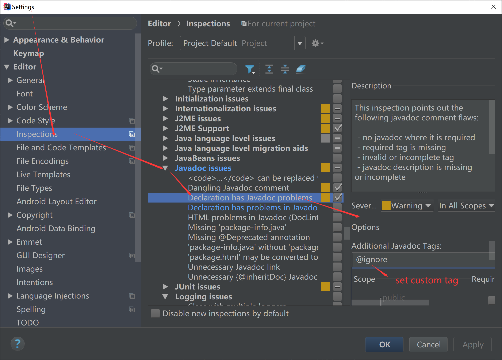

# 代码使用

smart-doc的实现初衷是通过使用javadoc文档注释来去除注解式的侵入，因此smart-doc每增加一个功能首先都是去考虑javadoc原生的tag,下面对smart-doc使用的一些javadoc tag做介绍。

|  tag名称   |  使用描述   |
| --- | --- |
|  @param  | 对于在Spring Boot接口层，对于简单类型的参数必须在使用@param时写上注释描述，对于Entity类型smart-doc则不会检查    |
|  @deprecated  |可以在注释中用于标记接口已经废弃，作用同@Deprecated注解|
|  @apiNote | @apiNote是java新增的文档tag,smart-doc使用@apiNote的注释作为方法的详细描述，因此可以使用apiNote来写一段长注释。如果一个方法不写 @apiNote注释说明，smart-doc直接使用方法默认注释填充|


# javadoc使用
## 1.1 @param 特殊用法
smart-doc针对java原生的@param添加一些特殊的用法。
- 对基本类型请求参数设置mock值

```java
/**
 * Test @RequestParam
 *
 * @param author 作者|村上春树
 * @param type   type
 */
@GetMapping("testRequestParam")
public void testRequestParam(@RequestParam String author, @RequestParam String type) {

}
```
上面通过|符号后面添加了作者的mock值为`村上春树`

- 参数对象替换

例如一些对象在框架底层做了特殊处理，smart-doc根据原始参数对象依赖过于强大的分析处理后的文档可能并不符合要求，这时你可以定义一个参数对象来
替换，然后smart-doc按照你指定的对象来输出文档。

例如：使用jpa的Pageable作为接口参数接收对象时spring框架做了处理，实际生真正的属性是PageRequest,不过smart-doc如果采用PageRequest会推到出一些不必要的属性，该功能从smart-doc 1.8.5开始提供。

```java
/**
 * 参数对象替换测试
 * @param pageable com.power.doc.model.PageRequestDto
 * @return
 */
@PostMapping(value = "/enum/resp")
public SimpleEnum resp(@RequestBody Pageable pageable){
    return null;
}
```
上面的写法中smart-doc就会使用`com.power.doc.model.PageRequestDto`代替jpa的Pageable做文档渲染，注意类名必须是全类名。
下面来看smart-doc支持的书写方式

```java
@param pageable com.power.doc.model.PageRequestDto
@param pageable 你的注释|com.power.doc.model.PageRequestDto
# smart-doc本身基于泛型推导，如果需要泛型则需要写上具体的对象
@param pageable com.power.doc.model.PageRequestDto<com.power.doc.model.User>
```
> 尽量少采用这种参数替换的形式，代码书写很不方便，建议直接自己定义对象作为入参
## 1.2 @apiNote
@apiNote是java新增的文档tag,smart-doc使用@apiNote的注释作为方法的详细描述，因此可以使用apiNote来写一段长注释。如果一个方法不写 @apiNote注释说明，
smart-doc直接使用方法默认注释填充。@apiNote详细使用参考如下：

```java
/**
 * 查询用户信息
 * @param name 用户名
 * @apiNote 通过用户的名称去查询到用户的详细信息                
 * @return
 */
@PostMapping(value = "/query")
public String resp(@RequestBody String name){
    return null;
}
```
## 1.3 @deprecated
注意注解是@Deprecated，首字母是大写，这里说的是javadoc tag里面的。
官方文档是这样描述的
```shell
Adds a comment indicating that this API should no longer be used.
```
意思就是在注释里使用@deprecated标记该api已经弃用。
```java
/**
 * 查询用户信息
 * @param name 用户名
 * @apiNote 通过用户的名称去查询到用户的详细信息  
 * @deprecated
 * @return
 */
@PostMapping(value = "/query")
public String resp(@RequestBody String name){
    return null;
}
```
# smart-doc自定义注释tag

tag名称 | 描述
---|---
@ignore| ignore tag用于过滤请求参数对象上的某个字段，设置后smart-doc不输出改字段到请求参数列表中。关于响应字段忽略的请看[【忽略响应字段】](https://smart-doc-group.github.io/#/zh-cn/diy/advancedFeatures?id=响应字段忽略)，如果ignore加到方法上，则接口方法不会输出到文档。从1.8.4开始ignore支持添加到controller上进行忽略不想生成文档的接口类。ignore也可以用于方法上忽略某个请求参数。
@required|如果你没有使用JSR303参数验证规范实现的方式来标注字段，就可以使用@required去标注请求参数对象的字段，标注smart-doc在输出参数列表时会设置为true。
@mock|从smart-doc 1.8.0开始，mock tag用于在对象基本类型字段设置自定义文档展示值。设置值后smart-doc不再帮你生成随机值。方便可以通过smart-doc直接输出交付文档。
@dubbo|从smart-doc 1.8.7开始，dubbo tag用于在dubbo的api接口类上添加让smart-doc可以扫描到dubbo rpc的接口生成文档。
@restApi|从smart-doc 1.8.8开始，restApi tag用于支持smart-doc去扫描Spring Cloud Feign的定义接口生成文档。
@order|从smart-doc 1.9.4开始，order tag用于设置controller接口或者api入口的自定义排序序号，@order 1就表示设置序号为1。
@ignoreResponseBodyAdvice|从smart-doc 1.9.8开始，ignoreResponseBodyAdvice tag用于忽略ResponseBodyAdvice设置的包装类。
@download|从smart-doc 2.0.1开始，download tag用于标注在controller的文件下载方法上，生成debug页面时可实现文件下载测试。并且支持下载文件带请求头参数测试。
@page|从smart-doc 2.0.2开始，page tag用于标注在controller的方法上表示该方法用来渲染返回一个静态页面，生成debug页面时如果发起测试，测试页面会自动在浏览器开启新标签显示页面。
@ignoreParams|从smart-doc 2.1.0开始，ignoreParams tag用于标注在controller方法上忽略掉不想显示在文档中的参数，例如：@ignoreParams id name，多个参数名用空格隔开
@response|从smart-doc 2.2.0开始，response tag标注在controller方法上可以允许用这自己定义返回的json example。建议只在返回基础类型时使用，如：Result<String>类型这种泛型是简单原生类型的响应。
@tag|@since 2.2.5, @tag用于将controller方法分类, 可以将不同contoller下的方法指定到多个分类下, 同时也可以直接指定controller为一个分类或多个分类


> 以上的一些自定义tag，我们建议国内的同学认真阅读这部分全部文档。包括后面对于一些tag的使用当中官方也给
了文字提示，不要去乱用。也不要觉得可以说服官方能够对当前的一些自定义tag做丰富。
首先我们是一个非常尊重编码规范的工具，我们不会去随便乱加一个东西来误导人，当前主流框架不提供的东西，我们不会在提供，
以后对tag的使用只会更加谨慎。

## 2.1 @ignore使用

```java
/**
 * 这是一个早期版本的错误示范
 */
public class SubUser {

    /**
     * 用户名称
     */
    private String subUserName;

    /**
     * 身份证
     */
    private String idCard;

    /**
     * 性别
     */
    private int gender;

    /**
     *  创建时间
     *  @ignore
     */
    private Timestamp createTime;

}


```
未来@ignore只能用于标注在方法和类的注释中。

> 对于实体字段，建议使用Json转换框架的注解去忽略，上面这种属于smart-doc早期的错误示范，
未来的版本中@ignore忽略字段的功能会被下线，Jackson和Fastjson的注解smart-doc都是支持的，
官方不建议采用这种无法做到表现和行为一致的方式。


在Controller层用SubUser作为参数接收，smart-doc输出的参数请求文档：

| Parameter | Type | Description | Required |
| --- | --- | --- | --- |
| subUserName | string | 用户名称 | false |
| numbers | number | No comments found. | false |
| idCard | string | 身份证 | false |
| gender | int | 性别 | false|

## 2.2 @required使用(不推荐)
官方已经支持JSR303，未来的版本中这个会被移除。 不建议采用这种无法做到表现和行为一致的方式，请使用JSR-303参数验证规范。smart-doc原生支持JSR-303，甚至是JSR-303的分组验证
也是支持的。
```java
public class SubUser {

    /**
     * 用户名称
     */
    private String subUserName;

    /**
     * 身份证
     */
    private String idCard;

    /**
     * 性别
     * @required
     */
    private int gender;

    /**
     *  创建时间
     *  @ignore
     */
    private Timestamp createTime;

}


```

在Controller层用SubUser作为参数接收，smart-doc输出的参数请求文档：

| Parameter | Type | Description | Required |
| --- | --- | --- | --- |
| subUserName | string | 用户名称 | false |
| numbers | number | No comments found. | false |
| idCard | string | 身份证 | false |
| gender | int | 性别 | true |


## 2.3 @mock使用

```java
public class SimpleUser {

    /**
     * 用户名
     * @mock 张三
     * @since v1.0
     */
    @NotNull
    private String username;

    /**
     * 密码
     * @mock 12356
     * @since v1.0
     */
    private String password;

}
```
在Controller层用SimpleUser作为参数接收，smart-doc不再使用随机值。smart-doc输出的参数请求示例：

```
{
    "username":"张三",
    "password":"12356"
}
```
## 2.4 @download使用
用于告诉smart-doc。你的controller中某一个方法是文件下载接口，smart-doc在生成debug调试页面时，可以生成一个文件下载的请求。后台参考代码如下：

```java
/**
 * BaseController
 *
 * @author yu on 2020/11/28.
 */
public abstract class BaseController {

    private static final Logger LOGGER = LoggerFactory.getLogger(BaseController.class);

    /**
     * excel文件
     */
    public static final String EXCEL_CONTENT_TYPE = "application/vnd.ms-excel;charset=utf-8";

    /**
     * 普通的文本
     */
    public static final String TEXT_CONTENT_TYPE = "application/octet-stream;charset=utf-8";

    /**
     * 导出excel,添加文件名时需要自己添加后缀
     *
     * @param fileName 文件名(用户信息表.xls)
     * @param response HttpServletResponse
     * @return ServletOutputStream
     * @throws Exception
     */
    protected ServletOutputStream exportExcel(String fileName, HttpServletResponse response) throws IOException {
        return baseDownload(EXCEL_CONTENT_TYPE,fileName,response);
    }

    /**
     * 基础的文件下载
     * @param contentType 下载文件的类型
     * @param fileName
     * @param response
     * @return
     * @throws IOException
     */
    protected ServletOutputStream baseDownload(String contentType, String fileName, HttpServletResponse response)
            throws IOException {
        response.setContentType(contentType);
        response.setHeader(HttpHeaders.CONTENT_DISPOSITION, "attachment;filename="
                + new String(fileName.getBytes("gbk"), "iso-8859-1"));
        return response.getOutputStream();
    }

    /**
     * 文件下载
     * @param fileName 下载文件
     * @param response 响应
     * @return
     * @throws IOException
     */
    protected ServletOutputStream downloadText(String fileName,HttpServletResponse response) throws IOException{
        return baseDownload(TEXT_CONTENT_TYPE,fileName,response);
    }

}
```
文件下载处理controller

```java
/**
 * 文件下载测试
 *
 * @author yu 2020/12/14.
 */
@RestController
@RequestMapping("download")
public class DownloadController extends BaseController {
    private static final Logger LOGGER = LoggerFactory.getLogger(DownloadController.class);
    /**
     * 下载普通文件文件
     *
     * @param response
     * @return
     * @throws IOException
     * @download
     */
    @PostMapping("text/{id}")
    public void download(HttpServletResponse response) throws IOException {
        String randomStr = RandomUtil.randomNumbers(50);
        String fileName = "test.log";
        //要使用smart-doc debug页面测试文件下载，则必须设置filename响应头，否则请采用其他模拟工具测试。
        // urlDecode用于处理中文件名
        response.setHeader("filename", urlEncode(fileName));// since 2.0.2后不需要这样设置
        ServletOutputStream outputStream = this.downloadText(fileName, response);
        outputStream.write(randomStr.getBytes());
    }

    public String urlEncode(String str) {
        if (StringUtil.isEmpty(str)) {
            return null;
        } else {
            try {
                return java.net.URLEncoder.encode(str, "UTF-8");
            } catch (UnsupportedEncodingException e) {
                e.printStackTrace();
                return null;
            }
        }
    }
}
```
> smart-doc 2.0.2版本将会自动从下载响应头`Content-Disposition: attachment; filename=xx`中读取文件名，不再需要在响应头中设置`response.setHeader("filename", urlEncode(fileName));`。当然即便是Content-Disposition也记得使用urlEncode处理下文档名，否则会出现中文文件名乱码。如果你是直接使用浏览器打开生成的smart-doc生成的测试页面，测试并不能获取到Content-Disposition，生成的是随机文件名，要验证正确性请通过服务的方式访问页面。

## 2.4 @page使用

```java
/**
 * arthas火焰图列表
 *
 * @return
 * @page /arthas-output.html
 * @apiNote 返回一个展示火焰图文件的arthas-output.html
 */
@GetMapping("arthas-output.html")
public String render() {
    Template template = BeetlTemplateUtil.getByName("arthas-output.tpl");
    List<FileInfo> files = FileUtil.getFilesFromFolder(environment.getProperty("arthas.output.path", OUTPUT_PATH));
    template.binding("path", "arthas-output");
    template.binding("fileInfoList", files);
    return template.render();
}
```
> 这个例子中用beetl来编写了一个html模板，正常情况下访问arthas-output.html。会返回渲染后的界面，如果你想在debug页面中点击请求直接访问该页面，那么你可以用@page来告诉smart-doc你的渲染页面名称。这样在debug页面上就可以直接帮你打开新的页签来访问页面。

## 2.5 @ignoreParams使用

```java
/**
 * 测试时间
 * @ignoreParams id
 * @param id 编号
 * @param dateEntity
 */
@PostMapping("data-date")
public CommonResult<DateEntity> test(int id,@RequestBody DateEntity dateEntity){
    return null;
}
```
把id参数忽略掉，不要展示在文档中，这种主要是传统的有状态后台管理系统中的用户状态参数。

>如果你要忽略的是一个Spring或者是JAX-RS这种顶级开源项目或者统一规范的参数时，请给官方提issue。例如你发现smart-doc不能忽略Spring
的@SessionAttribute注解的参数，那么你完成可以给官方提issue。
## 2.6 @response使用(不推荐)

```java
/**
 * 测试response tag
 *
 * @return
 * @response {
 * "success": true,
 * "message": "success",
 * "data": "hello",
 * "code": "68783",
 * "timestamp": "2021-06-15 23:05:16"
 * }
 */
@GetMapping("/test")
public CommonResult<String> create() {
    return null;
}
```
把id参数忽略掉，不要展示在文档中，这种主要是传统的有状态后台管理系统中的用户状态参数。

>对于使用@response的用户，我们只能认为你的代码是在太不清晰了，最好的就是代码写规范，让smart-doc能够自动生成返回样例。


## 2.7 @tag使用
```java
/**
 * json file config test
 * @tag dev
 * @author cqmike 2021-07-16 14:09
 **/
@RestController
public class ConfigRequestParamController {

    /**
     * get request test query param
     * @tag test
     * @author cqmike
     * @return
     */
    @GetMapping("configQueryParamGet")
    public void configQueryParamGet(String configQueryParam) {

    }

    /**
     * post request test query param
     *
     * @tag test
     * @author cqmike
     * @return
     */
    @PostMapping("configQueryParamPost")
    public void configQueryParamPost(String configQueryParam) {

    }
}
```
@tag用于将controller方法分类, 可以将不同contoller下的方法指定到多个分类下, 同时也可以直接指定controller为一个分类或多个分类

# IDEA自定义tag提示
自定义的tag默认是不会自动提示的，需要用户在idea中进行设置。设置好后即可使用，下面以设置smart-doc自定义的mock tag为例，设置操作如下：


使用其它开发工具的用户请自行查找相关工具的自定义tag提示设置。


