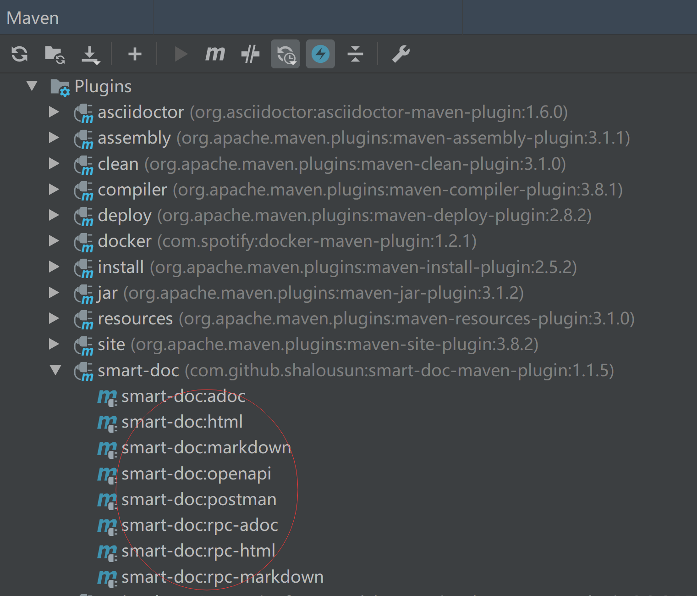
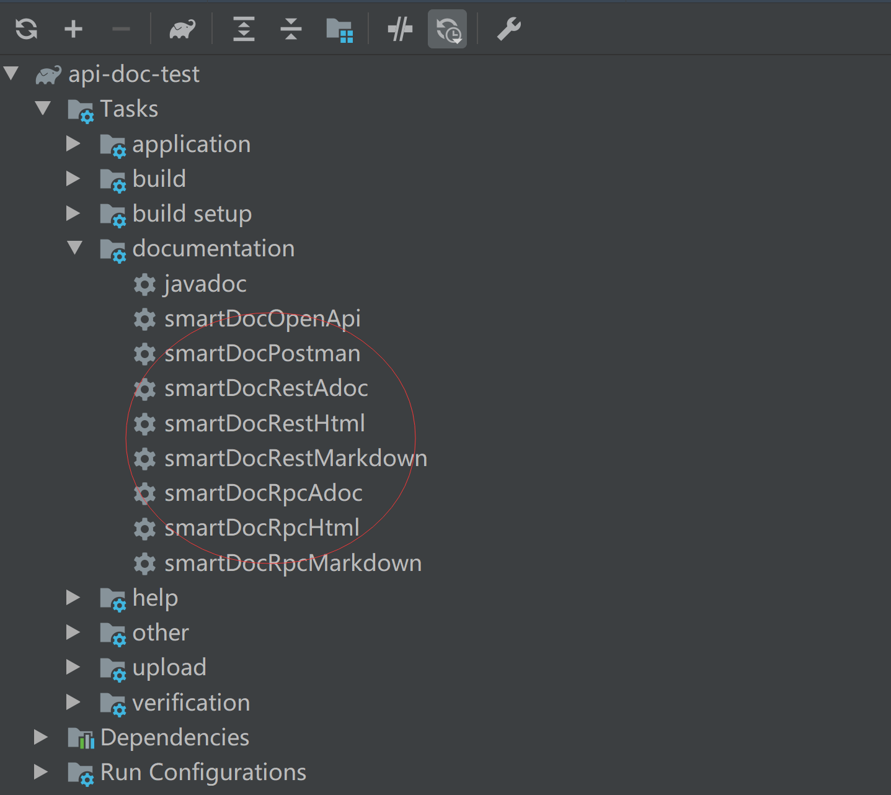

# 快速开始

> smart-doc官方目前已经开发完成Maven插件和Gradle插件，你可以根据自己的构建工具来选择使用Maven插件或者是Gradle插件。


## 最小配置单元

在自己的项目中创建一个`json`配置文件，`smart-doc-maven-plugin`或`smart-doc-gradle-plugin`插件会根据这个配置生成项目的接口文档。
例如在项目中创建`/src/main/resources/smart-doc.json`。配置内容参考如下。
> **outPath**: 指定文档的输出路径,相对路径时请用./开头，eg:./src/main/resources/static/doc
```json
{
   "outPath": "D://md2" 
}
```
1. 如果你想把`html`文档也打包到应用中一起访问，则建议你配置路径为：`src/main/resources/static/doc`
2. 如果是多个模块则放到需要生成文档的模块中。

## Maven插件

对于多模块的`Maven`，把`smart-doc`插件相关配置放到启动模块的`pom.xml`中。

```xml
<plugin>
    <groupId>com.github.shalousun</groupId>
    <artifactId>smart-doc-maven-plugin</artifactId>
    <version>[最新版本]</version>
    <configuration>
        <!--指定生成文档的使用的配置文件,配置文件放在自己的项目中-->
        <configFile>./src/main/resources/smart-doc.json</configFile>
        <!--指定项目名称-->
        <projectName>测试</projectName>
        <!--smart-doc实现自动分析依赖树加载第三方依赖的源码，如果一些框架依赖库加载不到导致报错，这时请使用excludes排除掉-->
        <excludes>
            <!--格式为：groupId:artifactId;参考如下-->
            <!--也可以支持正则式如：com.alibaba:.* -->
            <exclude>com.alibaba:fastjson</exclude>
        </excludes>
        <!--includes配置用于配置加载外部依赖源码,配置后插件会按照配置项加载外部源代码而不是自动加载所有，因此使用时需要注意-->
        <!--smart-doc能自动分析依赖树加载所有依赖源码，原则上会影响文档构建效率，因此你可以使用includes来让插件加载你配置的组件-->
        <includes>
            <!--格式为：groupId:artifactId;参考如下-->
            <!--也可以支持正则式如：com.alibaba:.* -->
            <include>com.alibaba:fastjson</include>
        </includes>
    </configuration>
    <executions>
        <execution>
            <!--如果不需要在执行编译时启动smart-doc，则将phase注释掉-->
            <phase>compile</phase>
            <goals>
                <!--smart-doc提供了html、openapi、markdown等goal，可按需配置-->
                <goal>html</goal>
            </goals>
        </execution>
    </executions>
</plugin>
```
> 请勿盲目复制上述maven插件的配置项，请先仔细阅读每个配置项的注释，然后根据自己项目情况去配置。
否则可能造成生成文档时无法加载源代码注释。


#### Use Maven Command

添加好插件和配置文件后可以直接运行`Maven`命令生成文档。
```bash
//生成html
mvn -Dfile.encoding=UTF-8 smart-doc:html
//生成markdown
mvn -Dfile.encoding=UTF-8 smart-doc:markdown
//生成adoc
mvn -Dfile.encoding=UTF-8 smart-doc:adoc
//生成postman json数据
mvn -Dfile.encoding=UTF-8 smart-doc:postman
// 生成 Open Api 3.0+,Since smart-doc-maven-plugin 1.1.5
mvn -Dfile.encoding=UTF-8 smart-doc:openapi
// 生成文档推送到Torna平台
mvn -Dfile.encoding=UTF-8 smart-doc:torna-rest

// Apache Dubbo RPC文档
// Generate html
mvn -Dfile.encoding=UTF-8 smart-doc:rpc-html
// Generate markdown
mvn -Dfile.encoding=UTF-8 smart-doc:rpc-markdown
// Generate adoc
mvn -Dfile.encoding=UTF-8 smart-doc:rpc-adoc

// 生成dubbo接口文档推送到torna
mvn -Dfile.encoding=UTF-8 smart-doc:torna-rpc
```

**注意：** 尤其在window系统下，如果实际使用Maven命令行执行文档生成，可能会出现乱码，因此需要在执行时指定`-Dfile.encoding=UTF-8`。


#### Use in IDEA



#### Building

如果你需要自己构建`smart-doc`，那可以使用下面命令，构建需要依赖`JDK 1.8`及以上版本。

```shell
mvn clean install -Dmaven.test.skip=true
```


## Gradle插件

Using the plugins DSL:
```gradle
plugins {
  id "com.github.shalousun.smart-doc" version "[最新版本]"
}
```

Using legacy plugin application:
```gradle
buildscript {
    repositories {
        maven { url 'http://maven.aliyun.com/nexus/content/groups/public/' }
        maven { url = uri("https://plugins.gradle.org/m2/") }
        mavenCentral()
    }
    dependencies {
        classpath 'com.github.shalousun:smart-doc-gradle-plugin:[最新版本]'
    }
}
apply(plugin = "com.github.shalousun.smart-doc")
```

**插件配置项**

| Option | Default value                     | Description                                                                                       |
| ------ |-----------------------------------|---------------------------------------------------------------------------------------------------|
|configFile| `src/main/resources/smart-doc.json` | 插件配置文件                                                                                            |
|exclude| 	无                                | 排除一些无法或者是无需自动下载的`java lib sources`,例如:`exclude 'org.springframework.boot:spring-boot-starter-tomcat'` |
|include| 	无                                | 让插件自动下载指定的`java lib sources`,例如:`include 'org.springframework.boot:spring-boot-starter-tomcat' `     |

Example setting of options:
```
smartdoc {
    configFile = file("src/main/resources/smart-doc.json")
    
    // exclude example
    // exclude artifact
    exclude 'org.springframework.boot:spring-boot-starter-tomcat'
    // exclude artifact use pattern
    exclude 'org.springframework.boot.*'
    // You can use the include configuration to let the plugin automatically load the specified source.
    // include example
    include 'org.springframework.boot:spring-boot-starter-tomcat'
}
```
对于多模块的`Gradle`，把`smart-do`c插件相关配置放到根目录`build.gradle`的`subprojects`中。
```
subprojects{
    apply plugin: 'com.github.shalousun.smart-doc'
    smartdoc {
        //
        configFile = file("src/main/resources/smart-doc.json")
        // exclude artifact
        exclude 'org.springframework.boot:xx'
        exclude 'org.springframework.boot:ddd'
        // You can use the include configuration to let the plugin automatically load the specified source.
        // include example
        include 'org.springframework.boot:spring-boot-starter-tomcat'
    }
}
```
#### Use Gradle command
```
//生成html
gradle smartDocRestHtml
//生成markdown
gradle smartDocRestMarkdown
//生成adoc
gradle smartDocRestAdoc
//生成postmanjson数据
gradle smartDocPostman
//生成Open Api 3.0 +规范的json文档
gradle smartDocOpenApi
//生成rest接口文档并推送到Torna平台
gradle tornaRest

// Apache Dubbo Rpc生成
// Generate html
gradle smartDocRpcHtml
// Generate markdown
gradle smartDocRpcMarkdown
// Generate adoc
gradle smartDocRpcAdoc
```
#### Use IDEA
当你使用`IDEA`时，可以通过`Gradle Helper`插件选择生成何种文档。



#### Building
如果你需要自己构建，那可以使用下面命令，构建需要依赖`JDK 1.8`及以上版本。
```
// 将gradle插件暗转到本地
gradle publishToMavenLocal
// 将gradle插件发布到自己nexus仓库，自己修改build.gradle中的仓库地址配置
gradle uploadArchives
```